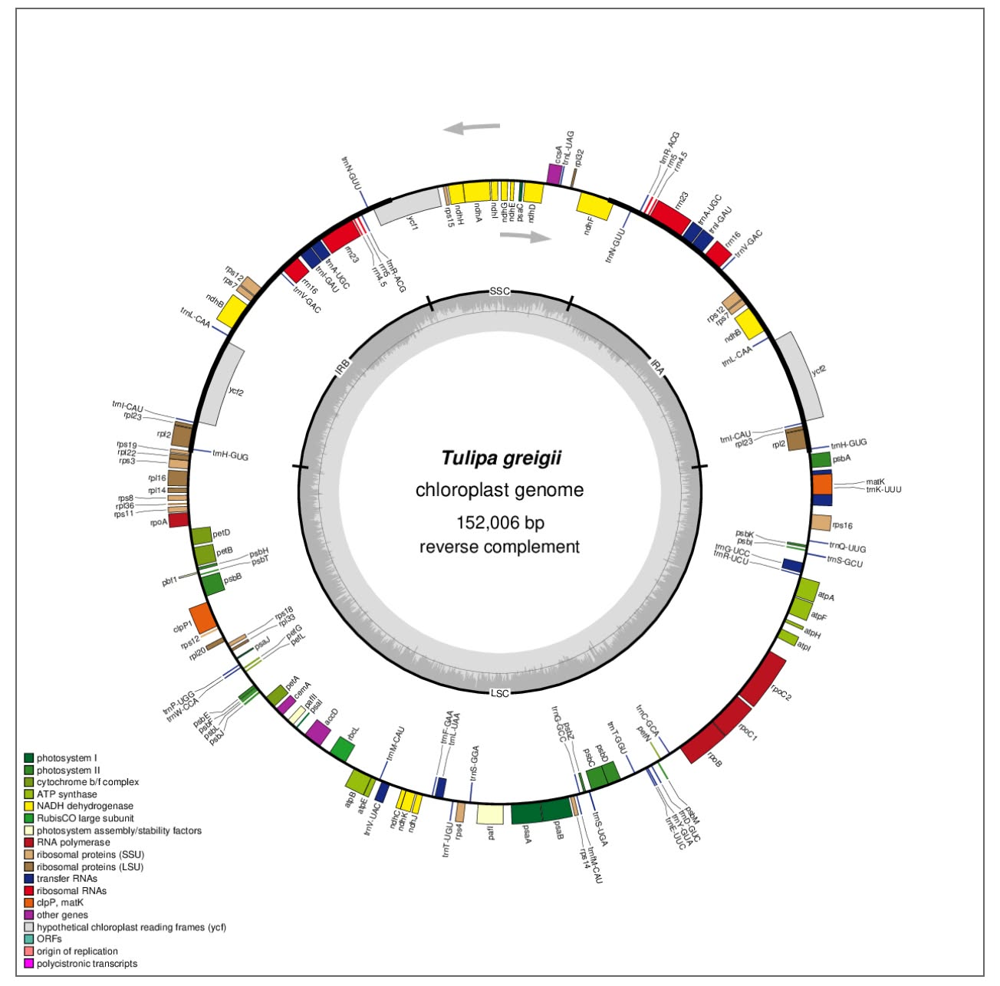

# Plastid Genome Visualization – *Tulipa greigii*

## Student Information

**Student:** Willhelm Galvez  
**Course:** Cell and Molecular Biology  
**Activity:** Visualize Plastid Genome Structure

---

## 1. Study Organism

**Scientific name:** *Tulipa greigii*  
**Family:** Liliaceae  
**Organelle:** Chloroplast (plastid)  
**Accession:** NC_087048.1  
**Genome type:** Complete circular chloroplast genome  
**Genome size:** 152,006 bp

The selected plastid genome is the complete chloroplast genome of *Tulipa greigii* obtained from the NCBI Reference Sequence database.

---

## 2. Data Source

The annotated GenBank record used for genome visualization was obtained from the NCBI Reference Sequence (RefSeq) database.

**Accession:** NC_087048.1  
**Record:** *Tulipa greigii* chloroplast, complete genome  
**Source:** NCBI Reference Sequence (RefSeq)

The original annotated GenBank file is preserved in the `data/` folder of this repository.

---

## 3. Genome Visualization

The plastid genome was visualized using **OGDRAW (OrganellarGenomeDRAW)** through the Chlorobox platform.

The annotated GenBank record was loaded using the NCBI RefSeq accession **NC_087048.1**.

### OGDRAW Settings Used

- **Mode:** Standard
- **Genome structure:** Circular
- **Sequence source:** Plastid
- **Inverted repeats:** Auto
- **GC content graph:** Enabled
- **Direction of transcription:** Enabled
- **Full legend:** Enabled
- **Intron-containing gene labels:** Enabled
- **Output format:** PNG
- **Resolution:** Fine

### Plastid Genome Map


---

## 4. Plastid Genome Structure

The resulting map shows the typical circular organization of the *Tulipa greigii* chloroplast genome.

The genome contains:

- **LSC (Large Single-Copy region):** 82,169 bp
- **SSC (Small Single-Copy region):** 17,172 bp
- **IRa (Inverted Repeat A):** 26,330 bp
- **IRb (Inverted Repeat B):** 26,330 bp

The two inverted repeat regions separate the LSC and SSC regions.

---

## 5. Genome Features Visible in the Map

The OGDRAW map displays genes and other annotated features around the circular genome. Different colors represent different functional groups, including:

- Photosystem I
- Photosystem II
- Cytochrome b6/f complex
- ATP synthase
- NADH dehydrogenase
- Rubisco large subunit
- Photosystem assembly and stability factors
- RNA polymerase
- Ribosomal proteins
- Transfer RNAs
- Ribosomal RNAs
- clpP and matK
- Other genes
- Hypothetical chloroplast reading frames (ycf)
- ORFs
- Origin of replication
- Polycistronic transcripts

The map also shows the direction of transcription using arrows and displays the GC-content pattern around the genome.

---

## 6. Genome Characteristics

The *Tulipa greigii* chloroplast genome has a total length of **152,006 bp** and a total GC content of **36.62%**.

The genome contains **131 functional/annotated genes**, consisting of:

- **85 protein-coding genes**
- **38 tRNA genes**
- **8 rRNA genes**

The two inverted repeat regions contain duplicated genes. A total of **18 genes are duplicated in the IR regions**, including protein-coding, tRNA, and rRNA genes.

The annotated genome also contains the pseudogenes **ycf15** and **ycf68**.

---

## 7. Notable Observations

The graphical map makes several features of the chloroplast genome easy to observe:

1. The genome is circular and 152,006 bp in length.
2. The LSC is the largest single-copy region.
3. The SSC is smaller than the LSC.
4. Two inverted repeat regions, IRa and IRb, are present.
5. Genes are distributed around the entire circular genome.
6. Genes occur in different transcriptional orientations.
7. The map contains genes associated with photosynthesis, RNA processing, translation, and other chloroplast functions.
8. The GC-content graph shows variation in base composition across different parts of the genome.

---

## 8. Files in This Repository

```text
Lab_Plastid_Genome_Visualization/
│
├── README.md
│
├── data/
│   └── Tulipa_greigii_NC_087048.1.gb
│
├── figures/
│   └── Tulipa_greigii_plastid_map.png
│
└── answers/
    └── Lab_plastid_genome_answers.md
```

### File Descriptions

**`data/Tulipa_greigii_NC_087048.1.gb`**  
Original annotated GenBank record used as the input for genome visualization.

**`figures/Tulipa_greigii_plastid_map.png`**  
OGDRAW-generated circular plastid genome map.

**`answers/Lab_plastid_genome_answers.md`**  
Answers to the questions for the plastid genome visualization activity.

---

## 9. Reproducibility

The analysis can be reproduced by obtaining the complete annotated plastid genome for *Tulipa greigii* using accession **NC_087048.1**, loading the GenBank record into OGDRAW, selecting a circular plastid genome representation, and generating the graphical map with the settings documented above.

The original annotated GenBank file and generated genome map are included in this repository to provide evidence of the workflow and results.

---

## 10. References

National Center for Biotechnology Information (NCBI). *Tulipa greigii* chloroplast, complete genome. RefSeq accession **NC_087048.1**.

Tussipkan, et al. (2024). Kazakhstan tulips: comparative analysis of complete chloroplast genomes of four local and endangered species of the genus *Tulipa* L. *Frontiers in Plant Science*, 15, 1433253.

Greiner, S., Lehwark, P., & Bock, R. (2019). OrganellarGenomeDRAW (OGDRAW) version 1.3.1: expanded toolkit for the graphical visualization of organellar genomes. *Nucleic Acids Research*, 47, W59–W64.
